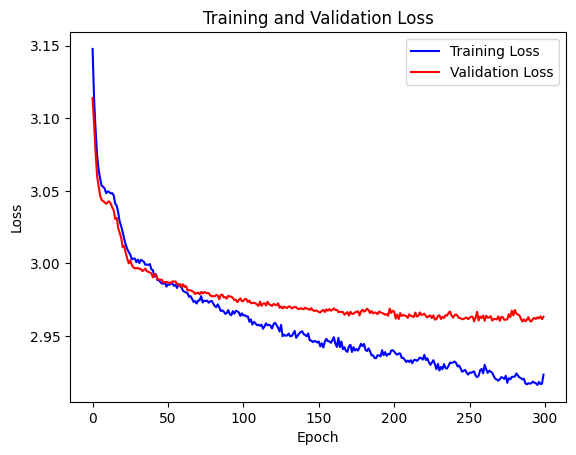
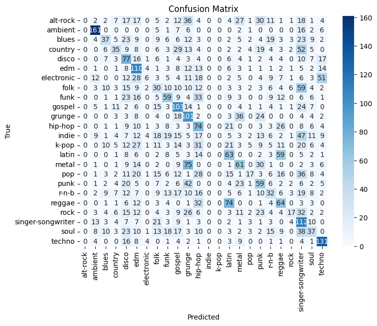
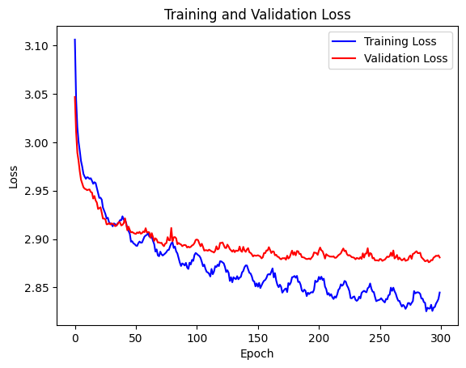
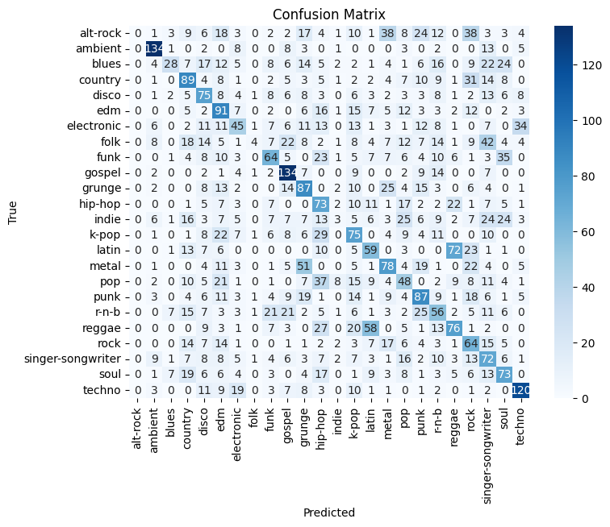

Erika Eddy, Kunal Singal, Tej Thambi  
Angad Kapoor, Khang Luu, Madhav Menon

# COM SCI M148 Final Project Report

## **i. Spotify Prediction Data Set**

We used the Spotify Prediction Data Set provided by the professor. The data set contains 114,000 songs (observations) from Spotify and this data was collected using Spotify’s Web API. Each observation contains information about that specific song, such as its name, track id, the artist’s name, the album to which the song belongs, and various audio features and characteristics, like danceability, energy, key, loudness, mode, speechiness, acousticness, instrumentalness, liveness, valence, tempo, and time_signature. Lastly, the dataset provides information on each track's popularity, whether it has explicit content, and the genre it belongs to, including 125 different genres.

## **ii. Overview of the Problem**

We wanted to build a genre prediction model that classifies songs into one of the 125 included genres from 16 numeric and categorical predictors.

## **iii. Key Methodology**

We decided to build a neural network multi-class classification model to predict the genres from 9 audio variables: danceability, energy, loudness, speechiness, acousticness, instrumentalness, liveness, valence, tempo. Additionally, even though there are 114 genres in the dataset, we believe that most of the included genres are not widely recognized globally and/or too niche. This is problematic because we realized from doing exploratory data analysis that each genre has exactly 1,000 songs represented in the dataset, which means that any models we built will have a bias toward niche genres with an overrepresentation and conversely an underrepresentation of popular genres with significantly more songs in reality, like pop. To avoid this, we selected 24 genres that we believed are globally popular for the model: alt-rock, ambient, blues, country, disco, edm, electronic, folk, funk, gospel, grunge, hip-hop, indie, k-pop, latin, metal, pop, punk, r-n-b, reggae, rock, singer-songwriter, soul, and techno. Lastly, we chose neural networks over other methods like decision trees or logistic regression because neural networks are capable of measuring complex, non-linear relationships between input features and target labels.

We began by standardizing the features and splitting the dataset into a 60% training, 20% validation, and 20% test sets. We then utilized a 4-layer fully connected neural network with ReLU activations, dropout layers, and batch normalization to prevent overfitting and improve generalization. Lastly, the output layer utilized the softmax activation function to compute probabilities for the 24 genres. Specifically, we had 256, 128, 64, and 32 neurons in successive layers because we wanted to reduce dimensionality and capture non-linear relationships between features. Our model was then trained for 300 epochs with a learning rate of 0.0001 and cosine annealing scheduler for learning rate decay.

## **iv. Results and Conclusion**

Figure 1: Training and Validation Loss Curves for Old Model

From the Training and Validation Loss Curves, we observed a steady and expected decrease in both training and validation loss without any oscillations, which indicates stable learning during training. Around 150 epochs, the validation loss plateaued slightly below 3, which implies that our model stopped improving on unseen data. Overall, our model achieved a test accuracy of 28.93%. This means that the model significantly underfits the data.

Figure 2: Confusion Matrix for Old Model

From the diagonal entries of the confusion matrix, the model’s classification performance varies widely across genres. For example, genres like Ambient and Techno have a large number of correctly predicted observations, whereas genres like Indie and K-Pop have no correctly predicted observations.

Obtaining a low test accuracy score from the initial model, we were determined to improve the model’s performance. First, we identified outliers for all numerical features by calculating z-scores for all observations; those with an absolute z-score exceeding a threshold of 0.999999 quantiled were flagged as outliers and subsequently removed. Features duration_ms, loudness, speechiness, and time_signature all had more than 200 outliers whereas the rest of the features had no outliers. This process was significant because we wanted to perform Principal Component Analysis (PCA) on the dataset and outliers can negatively impact the results.

After removing outliers, we performed PCA to reduce the dimensionality of the dataset. We determined that using 11 principal components was optimal to retain the minimum necessary information based on our PCA analysis conducted for the weekly check-in. The PCA transformation was applied to the standardized data, and the resulting principal component matrix was stored in a new data frame data_pcs.

Next, we trained a neural network using the aforementioned dataset. This model is similar to our previous model, with four hidden layers with 256, 128, 64, and 32 neurons. It also used ReLU, dropout layers, and batch normalization for regularization, stability, and generalization. We did change the learning rate to 0.0005 for training the model over 300 epochs.

Figure 3: Training and Validation Loss Curves for New Model

From the training and validation loss curves, we expected the new model to perform well. We did notice more oscillations compared to the previous model. Nevertheless, with an overall test accuracy of 34.57%, our new model performed significantly better than the previous model with a 5.64% gain in accuracy. Additionally, we had the model create multiple predictions for further testing: the top-2 accuracy, top-3 accuracy, and top-4 accuracy are 47.35%, 54.47%, and 59.55%, respectively.

Figure 4: Confusion Matrix for New Model

Comparing the confusion matrix of our old model versus our new model, we noticed significant prediction improvements. There was only one genre with no correct prediction in the new model, alt-rock, compared to three genres with no correct prediction in the old model. Furthermore, most genres observed more accurate predictions in the new model, like gospel, which increased from 103 to 134 correct predictions. Furthermore, the models are similar to each other in that they both performed really unevenly at classification for each genre. For example, Ambient and Techno have a large number of observations correctly predicted, whereas alt-rock, folk and indie have few or no correctly predicted observations. From these results, we believe that both models perform well on genres with distinct and easily identifiable audio features, while they struggle with genres with overlapping audio characteristics with other genres. Our argument is grounded in the broader context of the music industry, where genre boundaries are inherently subjective and socially constructed. Songs are often genre labeled differently depending on the listeners, resulting in ambiguity. Many artists further challenge these blurred boundaries by creating multi-genre tracks and albums. For example, Taylor Swift is known for writing popular hits and albums that span genres such as pop, country, indie, and alternative, while Post Malone’s latest album “F-1 Trillion” marks a significant transition from hip hop and pop to country.

Overall, we attribute our challenges in the models’ performance to a systematic flaw in the dataset regarding genre labeling. Specifically, we believe that the songs in the dataset were artificially labeled by the creator and we could not find any documentation about their methodology to validate or cross-reference the genre labels against official labels for the songs in the dataset.

Finally, the performance may also stem from the inherent limitations of using a neural network for this classification problem. Specifically, the neural network assumes that genres are mutually exclusive and so it assigns each song to a single genre with the highest probability. However, like we argued earlier, multiple genres can be equally valid for a single song. This single-label classification approach failed because it did not measure or consider the ambiguity and blurred boundaries that define genres, reducing the suitability of neural networks for this problem.

## **v. How to use the code?**

In order to use our code, add the dataset as a csv file to the same directory as the notebook. After this, you can simply run each cell in order. Each section has a note explaining what the code in that section does, and how it contributes to our overall goal of genre prediction. Running our code will reproduce the results, and the data could also be further tested using other tracks not in our initial dataset.
